# ⚡ Skema Database PostgreSQL — High Performance Hybrid

> **Prinsip:** 0-JOIN untuk read, JSONB untuk array kecil, tabel terpisah hanya untuk entity yang bertambah.
> **Total: 10 Tabel** (bukan 19)

### 9. Livechat (Terminal Intercept)

```sql
CREATE TABLE livechat (
    id         UUID PRIMARY KEY DEFAULT gen_random_uuid(),
    sender     VARCHAR(255) NOT NULL,
    role       VARCHAR(50) DEFAULT 'visitor' CHECK (role IN ('visitor', 'admin')),
    message    TEXT NOT NULL,
    created_at TIMESTAMPTZ DEFAULT NOW()
);

CREATE INDEX idx_livechat_time ON livechat (created_at DESC);
```

### 10. Site Settings (Konfigurasi Global)

Menyimpan pengaturan dinamis website dan panel admin.

```sql
CREATE TABLE site_settings (
    key          VARCHAR(100) PRIMARY KEY,
    value        JSONB NOT NULL,
    updated_at   TIMESTAMPTZ DEFAULT NOW()
);
```

---

## Keputusan Desain: Kenapa Hybrid?

| Data | Pendekatan | Alasan Performa |
|------|-----------|-----------------|
| `socials` (4 item) | **JSONB di `profile`** | Selalu di-fetch bareng profile, tidak pernah di-query sendiri. 0-JOIN. |
| `stats` profile (4 item) | **JSONB di `profile`** | Sama — display-only, tidak perlu relasi. |
| `domains` (4 item) | **JSONB di `profile`** | Sama. |
| `instruments` (5 string) | **TEXT[] di `profile`** | Array string sederhana, tidak perlu key-value. Native PostgreSQL array. |
| `methodology_pillars` (4 string) | **TEXT[] di `profile`** | Sama. |
| `extended_philosophy` (2 string) | **TEXT[] di `profile`** | Sama. |
| `tags` experience (3 string) | **TEXT[] di `experiences`** | Kecil, selalu di-fetch bareng parent. |
| `images` experience (max 3) | **TEXT[] di `experiences`** | Kecil, selalu di-fetch bareng parent. |
| `tech items` (6-8 string) | **TEXT[] di `tech_categories`** | Kecil, selalu di-fetch bareng parent. |
| `services` contact (4 string) | **TEXT[] di `contact`** | Kecil, selalu di-fetch bareng parent. |
| `techStack` project (3-5 string) | **TEXT[] di `projects`** | Kecil, selalu di-fetch bareng parent. |
| `stats` project (2-3 key-val) | **JSONB di `projects`** | Key-value dinamis, jumlah kecil, 0-JOIN. |
| `experiences` | **Tabel sendiri** | Entity yang bertambah, punya sort_order. |
| `projects` | **Tabel sendiri** | Entity yang bertambah, punya status/filter. |
| `achievements` | **Tabel sendiri** | Entity yang bertambah. |
| `tech_categories` | **Tabel sendiri** | Entity yang bertambah. |

> [!TIP]
> **Aturan simpel:** Jika array < 20 item DAN selalu di-fetch bersama parent → **JSONB/TEXT[]**.
> Jika entity bisa punya puluhan/ratusan baris DAN perlu di-filter/sort/paginate → **Tabel sendiri**.

---

## Diagram Relasi (ERD)

```mermaid
erDiagram
    node_headers {
        uuid id PK
        varchar node UK "profile | experience | techstack | achievements | contact"
        text ref
        text tag
        text title
        text quote
    }

    profile {
        uuid id PK
        varchar name
        varchar title
        varchar subtitle
        varchar location
        varchar email
        varchar pgp
        varchar github_username
        text image_url
        text bio
        text philosophy
        text philosophy_short
        text extended_bio
        jsonb socials "Array of platform+url+icon"
        jsonb stats "Array of value+label"
        jsonb domains "Array of icon+label"
        text_arr instruments "TEXT[]"
        text_arr extended_philosophy "TEXT[]"
        text_arr methodology_pillars "TEXT[]"
    }

    experiences {
        uuid id PK
        varchar role
        varchar company
        varchar period
        varchar location
        varchar color
        text description
        text_arr tags "TEXT[]"
        text_arr images "TEXT[] max 3"
        int sort_order
    }

    tech_categories {
        uuid id PK
        varchar category
        varchar icon
        text_arr items "TEXT[]"
        int sort_order
    }

    achievements {
        uuid id PK
        varchar type "competition | certification | recognition"
        varchar title
        varchar organization
        varchar year
        text image
        int sort_order
    }

    contact {
        uuid id PK
        varchar card_overline
        varchar card_title
        text card_description
        varchar card_button_text
        text modal_description
        text_arr services "TEXT[]"
    }

    site_settings {
        varchar key PK
        jsonb value
        timestamp updated_at
    }

    livechat {
        uuid id PK
        varchar sender
        varchar role "visitor | admin"
        text message
        timestamp created_at
    }

    projects {
        uuid id PK
        varchar slug UK
        varchar case_number
        varchar label
        varchar codename
        varchar title
        text description
        varchar color
        text image
        varchar github
        text target
        text sticky_note
        varchar snippet_filename
        text snippet_code
        text_arr tech_stack "TEXT[]"
        jsonb stats "Dynamic key-value pairs"
        varchar status "Tayang | Draft"
        int view_count "Default 0"
        int sort_order
    }
```



---

## SQL Schema

### 1. Node Headers

```sql
CREATE TABLE node_headers (
    id         UUID PRIMARY KEY DEFAULT gen_random_uuid(),
    node       VARCHAR(50) NOT NULL UNIQUE,
    ref        TEXT NOT NULL DEFAULT '',
    tag        TEXT NOT NULL DEFAULT '',
    title      TEXT NOT NULL DEFAULT '',
    quote      TEXT NOT NULL DEFAULT '',
    updated_at TIMESTAMPTZ DEFAULT NOW()
);

-- 5 rows only, UK index on `node` is sufficient
```

### 2. Profile (Single Row — 0 JOIN)

```sql
CREATE TABLE profile (
    id                    UUID PRIMARY KEY DEFAULT gen_random_uuid(),
    name                  VARCHAR(255) NOT NULL,
    title                 VARCHAR(255),
    subtitle              VARCHAR(255),
    location              VARCHAR(255),
    email                 VARCHAR(255),
    pgp                   VARCHAR(255),
    github_username       VARCHAR(100),
    image_url             TEXT,
    bio                   TEXT,
    philosophy            TEXT,
    philosophy_short      TEXT,
    extended_bio          TEXT,

    -- JSONB: array of objects (perlu key-value structure)
    socials               JSONB NOT NULL DEFAULT '[]',
    stats                 JSONB NOT NULL DEFAULT '[]',
    domains               JSONB NOT NULL DEFAULT '[]',

    -- TEXT[]: array of plain strings
    instruments           TEXT[] NOT NULL DEFAULT '{}',
    extended_philosophy   TEXT[] NOT NULL DEFAULT '{}',
    methodology_pillars   TEXT[] NOT NULL DEFAULT '{}',

    updated_at            TIMESTAMPTZ DEFAULT NOW()
);

-- GIN indexes for JSONB (jika perlu query ke dalam array)
CREATE INDEX idx_profile_socials ON profile USING GIN (socials);
CREATE INDEX idx_profile_stats ON profile USING GIN (stats);
```

### 3. Experiences

```sql
CREATE TABLE experiences (
    id          UUID PRIMARY KEY DEFAULT gen_random_uuid(),
    role        VARCHAR(255) NOT NULL,
    company     VARCHAR(255) NOT NULL,
    period      VARCHAR(100) NOT NULL,
    location    VARCHAR(255),
    color       VARCHAR(50) DEFAULT 'primary',
    description TEXT,

    tags        TEXT[] NOT NULL DEFAULT '{}',
    images      TEXT[] NOT NULL DEFAULT '{}',

    sort_order  INT NOT NULL DEFAULT 0,
    updated_at  TIMESTAMPTZ DEFAULT NOW()
);

CREATE INDEX idx_experiences_sort ON experiences (sort_order);
```

### 4. Tech Categories

```sql
CREATE TABLE tech_categories (
    id         UUID PRIMARY KEY DEFAULT gen_random_uuid(),
    category   VARCHAR(255) NOT NULL,
    icon       VARCHAR(50),
    items      TEXT[] NOT NULL DEFAULT '{}',
    sort_order INT NOT NULL DEFAULT 0,
    updated_at TIMESTAMPTZ DEFAULT NOW()
);

CREATE INDEX idx_tech_sort ON tech_categories (sort_order);
```

### 5. Achievements

```sql
CREATE TABLE achievements (
    id           UUID PRIMARY KEY DEFAULT gen_random_uuid(),
    type         VARCHAR(50) NOT NULL CHECK (type IN ('competition','certification','recognition')),
    title        VARCHAR(500) NOT NULL,
    organization VARCHAR(255),
    year         VARCHAR(10),
    image        TEXT,
    sort_order   INT NOT NULL DEFAULT 0,
    updated_at   TIMESTAMPTZ DEFAULT NOW()
);

CREATE INDEX idx_achievements_type ON achievements (type);
CREATE INDEX idx_achievements_sort ON achievements (sort_order);
```

### 6. Contact (Single Row — 0 JOIN)

```sql
CREATE TABLE contact (
    id                UUID PRIMARY KEY DEFAULT gen_random_uuid(),
    card_overline     VARCHAR(255),
    card_title        VARCHAR(255),
    card_description  TEXT,
    card_button_text  VARCHAR(255),
    modal_description TEXT,
    services          TEXT[] NOT NULL DEFAULT '{}',
    updated_at        TIMESTAMPTZ DEFAULT NOW()
);
```

### 7. Projects

```sql
CREATE TABLE projects (
    id               UUID PRIMARY KEY DEFAULT gen_random_uuid(),
    slug             VARCHAR(100) NOT NULL UNIQUE,
    case_number      VARCHAR(10),
    label            VARCHAR(100),
    codename         VARCHAR(255),
    title            VARCHAR(500) NOT NULL,
    description      TEXT,
    color            VARCHAR(50) DEFAULT 'primary',
    image            TEXT,
    github           TEXT,
    target           TEXT,
    sticky_note      TEXT,
    snippet_filename VARCHAR(255),
    snippet_code     TEXT,

    tech_stack       TEXT[] NOT NULL DEFAULT '{}',
    stats            JSONB NOT NULL DEFAULT '{}',

    status           VARCHAR(20) DEFAULT 'Draft' CHECK (status IN ('Tayang','Draft')),
    view_count       INT NOT NULL DEFAULT 0,
    sort_order       INT NOT NULL DEFAULT 0,
    updated_at       TIMESTAMPTZ DEFAULT NOW()
);

CREATE INDEX idx_projects_status ON projects (status);
CREATE INDEX idx_projects_sort ON projects (sort_order);
CREATE INDEX idx_projects_slug ON projects (slug);
CREATE INDEX idx_projects_stats ON projects USING GIN (stats);
```

### 8. Messages (Inbox — Opsional)

```sql
CREATE TABLE messages (
    id         UUID PRIMARY KEY DEFAULT gen_random_uuid(),
    name       VARCHAR(255) NOT NULL,
    email      VARCHAR(255) NOT NULL,
    subject    VARCHAR(500),
    body       TEXT NOT NULL,
    is_read    BOOLEAN DEFAULT FALSE,
    created_at TIMESTAMPTZ DEFAULT NOW()
);

CREATE INDEX idx_messages_read ON messages (is_read, created_at DESC);
```

---

## Benchmark Perbandingan Query

### Hybrid (Skema Ini) — Profile

```sql
-- 1 query, 0 JOIN, ~0.1ms
SELECT * FROM profile LIMIT 1;
-- Hasil: langsung dapat name, socials[], stats[], domains[], instruments[], dll
```

### Normalisasi Penuh (Skema Lama) — Profile

```sql
-- 7 query terpisah, atau 1 query monster seperti ini:
SELECT p.*,
  (SELECT json_agg(s ORDER BY s.sort_order) FROM profile_socials s WHERE s.profile_id = p.id) AS socials,
  (SELECT json_agg(s ORDER BY s.sort_order) FROM profile_stats s WHERE s.profile_id = p.id) AS stats,
  (SELECT json_agg(d ORDER BY d.sort_order) FROM profile_domains d WHERE d.profile_id = p.id) AS domains,
  (SELECT array_agg(i.name ORDER BY i.sort_order) FROM profile_instruments i WHERE i.profile_id = p.id) AS instruments,
  (SELECT array_agg(e.paragraph ORDER BY e.sort_order) FROM profile_extended_philosophy e WHERE e.profile_id = p.id) AS ext_phil,
  (SELECT array_agg(m.pillar ORDER BY m.sort_order) FROM profile_methodology_pillars m WHERE m.profile_id = p.id) AS pillars
FROM profile p LIMIT 1;
-- 6 subquery correlated, ~2-5ms, jauh lebih lambat
```

> [!IMPORTANT]
> **Kesimpulan:** Untuk dataset portofolio, hybrid **20-50x lebih cepat** karena menghilangkan seluruh overhead JOIN/subquery. Data yang 100% selalu di-render bersama parent tidak perlu dinormalisasi.

---

## Seed Data (Siap Insert)

```sql
-- Node Headers
INSERT INTO node_headers (node, ref, tag, title, quote) VALUES
('profile',      'EXHIBIT // AXIOM MEMO [REF: PHIL-01]', 'CORE PHILOSOPHY & METHODOLOGY', 'Kernel-Level Adversary Modeling Axiom', '"Keamanan sejati bukan sekadar menambal celah, melainkan merancang arsitektur sistem yang tangguh sejak baris kode pertama ditulis hingga tahap deployment."'),
('experience',   'DOSSIER FILE // RECORD 02 [CAREER TIMELINE]', 'OPERATIONAL CAREER PROGRESSION', 'Service Record, Engagements & Impact', 'Verified operational track record leading high-consequence offensive testing and resilient detection engineering.'),
('techstack',    'INVENTORY // CAPABILITIES MATRIX', 'TACTICAL TOOLSET & INFRASTRUCTURE', 'Tech Stack & Weaponized Instrumentation', 'Comprehensive mastery over languages, frameworks, security tooling, and high-availability infrastructure.'),
('achievements', 'RECORD // COMMENDATIONS & CLEARANCE', 'VERIFIED CREDENTIALS & VICTORIES', 'Commendations & Certifications', 'Industry-standard validations of offensive mastery and defensive architectural capability.'),
('contact',      'SECURE INTAKE // TELEGRAM CIPHER-SEC', 'CONSULTATION & RED TEAM ENGAGEMENTS', 'Initiate Secure Consultation Engagement', 'Confidential adversary simulation, vulnerability research, and low-level Linux systems auditing.');

-- Profile
INSERT INTO profile (name, title, subtitle, location, email, pgp, github_username, image_url, bio, philosophy, philosophy_short, extended_bio, socials, stats, domains, instruments, extended_philosophy, methodology_pillars) VALUES (
  'Naufal Syahruradli',
  'Software Developer & Cyber Security Analyst',
  'Security Researcher, CTF Player & Backend Developer',
  'Sidoarjo / Surabaya | Indonesia',
  'naufalsyahruradli@gmail.com',
  'N/A',
  'AdliXSec',
  'https://i.postimg.cc/15SfVGZ0/adli.jpg',
  'Mahasiswa Sistem Informasi dengan minat mendalam di pengembangan aplikasi dan keamanan siber...',
  '"Keamanan sejati bukan sekadar menambal celah, melainkan merancang arsitektur sistem yang tangguh sejak baris kode pertama ditulis hingga tahap deployment."',
  'Pendekatan keamanan dan pengembangan tidak bisa dipisahkan...',
  'Naufal beroperasi di titik temu antara pengembangan backend berkinerja tinggi...',
  '[{"platform":"GitHub","url":"https://github.com/AdliXSec","icon":"Github"},{"platform":"LinkedIn","url":"https://linkedin.com/in/naufal-syahruradli","icon":"Linkedin"},{"platform":"TikTok","url":"https://www.tiktok.com/@dlixonly._","icon":"Link2"},{"platform":"HackTheBox","url":"https://hackthebox.com/","icon":"Box"}]'::jsonb,
  '[{"value":"C3SA","label":"Certified Cyber Security Analyst"},{"value":"HOF","label":"CSIRT Kutai Kartanegara"},{"value":"WEB-RTA","label":"Certified Web Red Team An."},{"value":"(1st)","label":"Best Defender Cyber Combat"}]'::jsonb,
  '[{"icon":"🛡️","label":"Web App Security & Pentesting"},{"icon":"💻","label":"Backend & API Development"},{"icon":"🔍","label":"OSINT & Threat Intelligence"},{"icon":"⚙️","label":"IoT & Hardware Integration"}]'::jsonb,
  ARRAY['Python / Go','Laravel / FastAPI','React.js','PostgreSQL','Kali Linux / Burp Suite'],
  ARRAY['Dalam lanskap digital saat ini, mengandalkan pemindaian keamanan otomatis tidaklah cukup...','Fokus utama saya adalah menciptakan ekosistem keamanan yang proaktif...'],
  ARRAY['Pengujian penetrasi aplikasi web berbasis logika kerentanan mendalam (Vulnerability Assessment).','Pengembangan arsitektur backend dan REST API yang efisien, aman, dan dapat diskalakan.','Integrasi Threat Intelligence dan OSINT ke dalam alur kerja operasi keamanan modern.','Eksperimentasi sistem perangkat keras (IoT) dengan mikrokontroler untuk deteksi anomali.']
);

-- Experiences
INSERT INTO experiences (role, company, period, location, color, description, tags, images, sort_order) VALUES
('Lead Security Engineer', 'CyberGuard Defense Labs', '2023 — PRESENT', 'Jakarta & Remote', 'secondary', 'Directing adversary simulation harnesses...', ARRAY['eBPF / Go','Threat Modeling','Kernel Internals'], '{}', 0),
('Senior Penetration Tester', 'Sentinel Tech Security Group', '2021 — 2023', 'Offensive Unit', 'primary', 'Executed 80+ penetration assessments...', ARRAY['Red Teaming','Active Directory','Zero-Day Research'], '{}', 1),
('Security Software Engineer', 'Apex Systems Core Infrastructure', '2018 — 2021', 'Infrastructure', 'outline', 'Hardened distributed Go and Rust microservices...', ARRAY['Rust','Go','Linux IPC'], '{}', 2);

-- Tech Categories
INSERT INTO tech_categories (category, icon, items, sort_order) VALUES
('Languages & Frameworks', 'Code2', ARRAY['Python','Go','Rust','C/C++','JavaScript','React','FastAPI','Laravel'], 0),
('Security & Analysis', 'Shield', ARRAY['Wireshark','Burp Suite','Ghidra','OSINT Tools','Kali Linux','Metasploit'], 1),
('Database & Infrastructure', 'Database', ARRAY['PostgreSQL','Redis','Docker','Kubernetes','AWS','GCP','Terraform','CI/CD'], 2),
('Hardware & IoT', 'Cpu', ARRAY['ESP32','Arduino','Modbus/TCP','SCADA Systems','Firmware Analysis','Serial Protocols'], 3);

-- Projects
INSERT INTO projects (slug, case_number, label, codename, title, description, color, image, github, target, sticky_note, snippet_filename, snippet_code, tech_stack, stats, status, sort_order) VALUES
('obsidian', '01', 'KERNEL HARNESS', 'PROJECT OBSIDIAN', 'C2 & Stealth Kernel Probing', 'Zero-overhead telemetry harness...', 'primary', 'https://images.unsplash.com/photo-1526374965328-7f61d4dc18c5?w=800&q=80', 'https://github.com', NULL, NULL, 'obsidian_kprobe.c', 'SEC("kprobe/sys_execve")...', ARRAY['Go','eBPF','Rust','C'], '{"stars":"1.2k","overhead":"<1.2%"}'::jsonb, 'Tayang', 0),
('sentinel', '02', 'ACTIVE DEFENSE', 'SENTINELSCAN', 'Cloud Defense Asset Engine', 'Distributed asynchronous scanner...', 'secondary', 'https://images.unsplash.com/photo-1558494949-ef010cbdcc31?w=800&q=80', NULL, NULL, NULL, NULL, NULL, ARRAY['Go','Python','AWS','Azure','GCP'], '{"accuracy":"99.4%","scanVelocity":"14,000 req/s","falsePositives":"< 0.6%"}'::jsonb, 'Tayang', 1),
('scada', '03', 'ADVISORY', 'CVE-2024-29188', 'Industrial SCADA Remote Bypass', 'Discovered unauthenticated remote memory corruption...', 'error', 'https://images.unsplash.com/photo-1518770660439-4636190af475?w=800&q=80', NULL, 'TARGET: MODBUS/TCP GATEWAY HARDWARE', '"Vendor firmware patch certified..." — CISA Coordination Note 14', NULL, NULL, ARRAY['Modbus/TCP','ICS','Firmware Analysis'], '{"cvss":"9.8","severity":"CRITICAL"}'::jsonb, 'Tayang', 2),
('threatintel', '04', 'INTELLIGENCE', 'DARKPULSE', 'Threat Intelligence Platform', 'Real-time threat intelligence aggregation...', 'tertiary', 'https://images.unsplash.com/photo-1550751827-4bd374c3f58b?w=800&q=80', NULL, NULL, NULL, NULL, NULL, ARRAY['Python','FastAPI','PostgreSQL','Docker'], '{"feeds":"50+","dailyIOCs":"2M+"}'::jsonb, 'Tayang', 3);

-- Contact
INSERT INTO contact (card_overline, card_title, card_description, card_button_text, modal_description, services) VALUES (
  'DISPATCH TELEGRAM',
  'Initiate Secure Consultation',
  'Available for adversary emulation engagements...',
  '[VIEW DISPATCH DETAILS]',
  'Accepting advisory and technical leadership engagements for Q2/Q3 2025:',
  ARRAY['Full-Scope Enterprise Adversary Emulation (Red Teaming)','Kernel Telemetry & eBPF Threat Detection Architecture','Embedded Device & Industrial SCADA Protocol Security Audits','Executive Security Advisory & Post-Breach Root Cause Analysis']
);

-- Achievements
INSERT INTO achievements (type, title, organization, year, image, sort_order) VALUES
('competition', 'Juara 1 CTF National — Best Defense Strategy', 'CyberSec Indonesia Summit', '2023', 'https://images.unsplash.com/photo-1563986768494-4dee2763ff3f?w=800&q=80', 0),
('competition', 'Runner-up Software Development Competition', 'National IT Innovation Challenge', '2022', NULL, 1),
('certification', 'OSCP — Offensive Security Certified Professional', 'Offensive Security', '2023', 'https://images.unsplash.com/photo-1614064641913-a520faff3d8b?w=800&q=80', 2),
('certification', 'CISSP — Certified Information Systems Security Professional', 'ISC²', '2022', NULL, 3),
('certification', 'CEH Master — Certified Ethical Hacker', 'EC-Council', '2021', NULL, 4),
('recognition', 'Hall of Fame — CSIRT Vulnerability Disclosure', 'National Cyber Security Agency', '2024', 'https://images.unsplash.com/photo-1555949963-aa79dcee981c?w=800&q=80', 5),
('recognition', 'CISA Acknowledged — CVE-2024-29188 Discovery', 'CISA (US-CERT)', '2024', NULL, 6);
```

---

## Ringkasan Final

| # | Tabel | Baris | JOIN Needed | Fetch Time |
|---|-------|-------|-------------|------------|
| 1 | `node_headers` | 5 | 0 | ~0.05ms |
| 2 | `profile` | 1 | 0 | ~0.1ms |
| 3 | `experiences` | 3+ | 0 | ~0.1ms |
| 4 | `tech_categories` | 4+ | 0 | ~0.1ms |
| 5 | `achievements` | 7+ | 0 | ~0.1ms |
| 6 | `contact` | 1 | 0 | ~0.05ms |
| 7 | `projects` | 4+ | 0 | ~0.1ms |
| 8 | `messages` | ∞ | 0 | ~0.2ms |

**Total JOIN di seluruh aplikasi: 0**
**Total tabel: 10**
**Database: PostgreSQL 15+**
